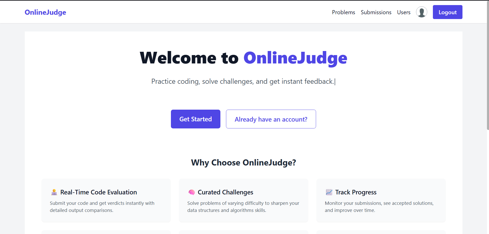
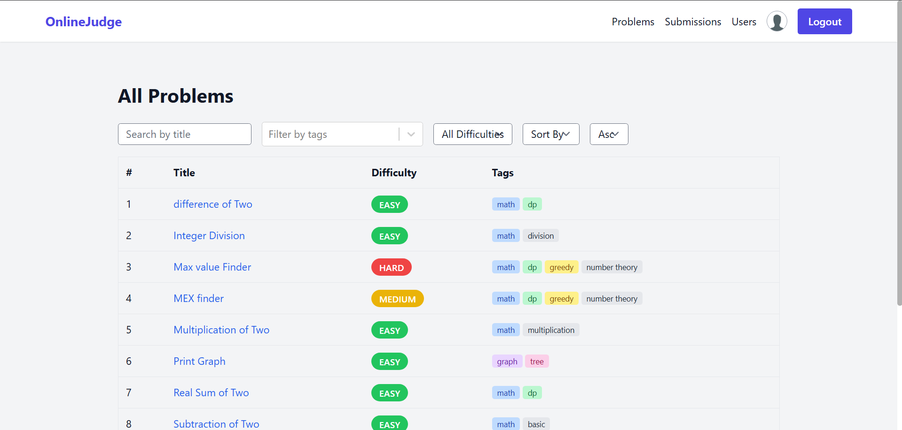
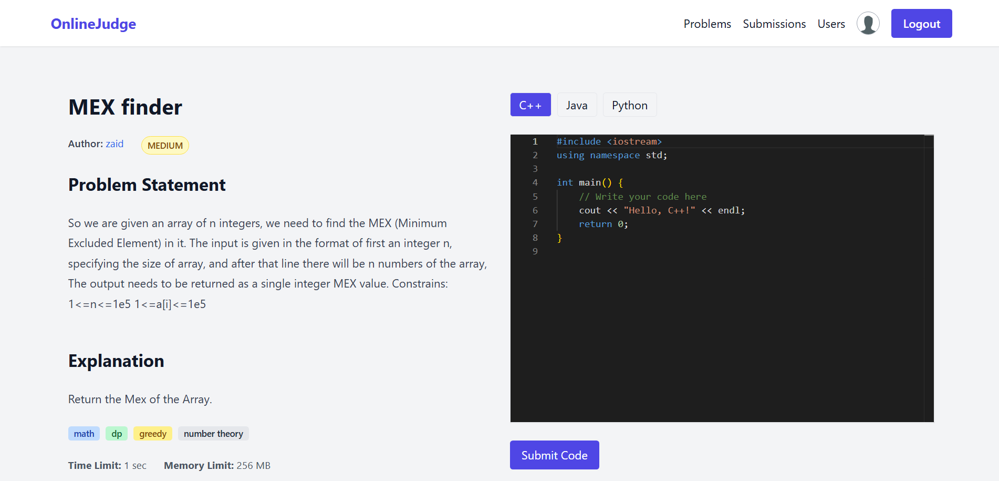
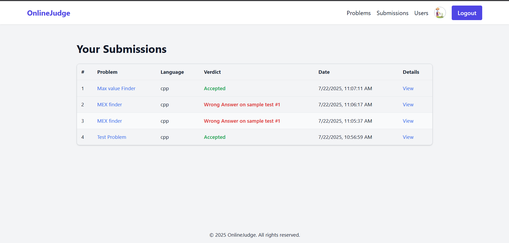
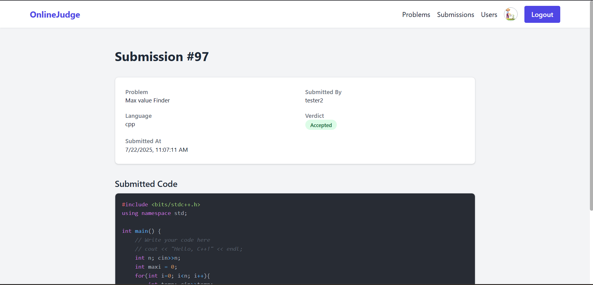
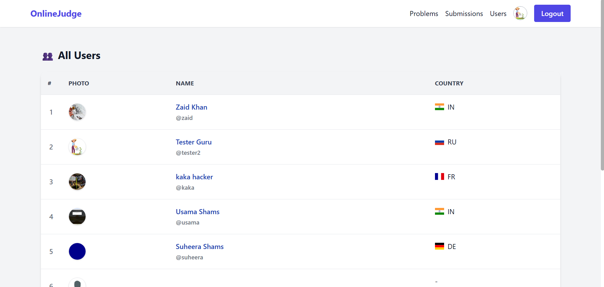

# 🧠 Online Judge Platform

A fully-featured **Online Judge** platform built with:

- ⚙️ **Spring Boot** backend (REST API, JWT auth, Dockerized code execution)
- 💻 **React** frontend (modern, responsive UI with user dashboard, submission tracking)
- 🐳 **Docker-based sandboxing** for secure code execution

> ✨ Ideal for practicing competitive programming, hosting coding contests, and tracking user progress in a secure and scalable environment.

---

## 📸 Screenshots

| Feature                            | Screenshot |
|-----------------------------------|------------|
| 🚀 Home Page                       |  |
| 📝 Problem Listing Page           |  |
| 📄 Problem Detail View            |  |
| 👨‍💻 Code Editor + Submission     |  |
| 📊 Submission Result / Verdict    |  |
| 👤 User Profile                   |  |
| 🧠 Admin Dashboard (Add Problems) |  |

> _Note: Replace the mock filenames `1.png`, `2.png`, etc., with actual filenames as needed._

---

## 🔧 Tech Stack

### 🖥 Frontend
- React + Vite
- React Router
- Axios
- Chart libraries (for activity graphs)
- Tailwind CSS / Styled Components

### 🛠 Backend
- Spring Boot
- JWT Authentication (with HTTP-only cookies)
- Role-based Access Control (User, Admin)
- Dockerized sandbox for secure code execution
- PostgreSQL / MySQL (configurable)
- JPA/Hibernate

---

## ✨ Key Features

### 👨‍💻 User-Facing Features
- View problems by difficulty, tags, and status
- Code editor with language support and syntax highlighting
- Real-time submission verdicts (AC, WA, TLE, MLE, CE)
- Public profiles with submission stats and activity graph
- Login, Signup, and Profile Update with image upload

### 🧑‍🏫 Admin Features
- Add / Edit / Delete Problems
- View all submissions
- Manage users and roles
- Monitor code execution logs (optional)

---

## 📁 Project Structure

```bash
OnlineJudge/
├── frontend/     # React app
├── backend/      # Spring Boot REST API
├── screenshots/  # Project screenshots
└── README.md     # You're reading it!
